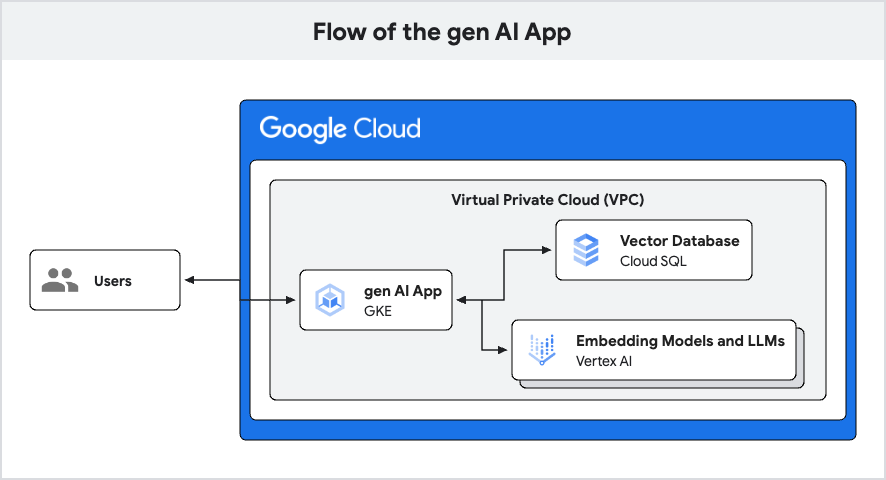

# Deploy a production ready GenAI app in less than 30 minutes

Here is a demo of how to build a basic chatbot API that:

- Leverages GKE or Cloud Run with Cloud SQL, VertexAI, and pgvector
- Demonstrates connectivity to Cloud SQL using Private Service Connect in a VPC
- Codifies all infrastructure including using Terraform
- Uses Python with asyncpg and FastAPI
- (optional) Supports cross-project setups with Cloud SQL and GKE or Cloud Run
  in separate projects

This demo is an operationalized version of a previously published colab,
[Building AI-powered data-driven applications using pgvector, LangChain and
LLMs][colab].

[colab]: https://colab.sandbox.google.com/github/GoogleCloudPlatform/python-docs-samples/blob/main/cloud-sql/postgres/pgvector/notebooks/pgvector_gen_ai_demo.ipynb

## Choose your Architecture

### GKE ([README](gke/README.md))

To deploy the app using GKE head to the [gke](gke/README.md) folder.
