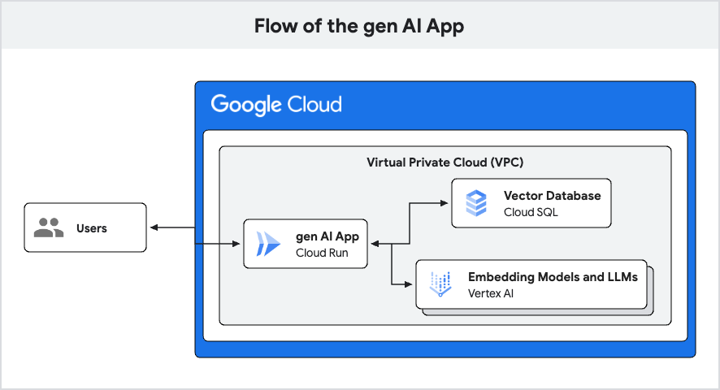

# Deploy a production ready GenAI app in less than 30 minutes



Here is a jump start solution of how to build a basic chatbot API that:

- Leverages Cloud Run, Cloud SQL, VertexAI, and pgvector
- Demonstrates connectivity to Cloud SQL using Private Service Connect in a VPC
- Codifies all infrastructure including using Terraform
- Uses Python with asyncpg and FastAPI
- (optional) Supports cross-project setups with Cloud SQL and Cloud Run in separate
  projects

This solution is an operationalized version of a previously published colab,
[Building AI-powered data-driven applications using pgvector, LangChain and
LLMs][colab].

[colab]: https://colab.sandbox.google.com/github/GoogleCloudPlatform/python-docs-samples/blob/main/cloud-sql/postgres/pgvector/notebooks/pgvector_gen_ai_demo.ipynb

## Installation and Setup

To get started you will need to install:

- gcloud (with a Google Cloud project configured)
- terraform

No one wants to write "terraform" on the CLI. So do this instead to save some
keystrokes:

```sh
alias tf="terraform"
```

Lastly, make sure you have gcloud pointing at the correct project where you
want this infrastructure to live:

```sh
gcloud config set project <PROJECT_ID>
```

## Overview of the jump start solution

There are a few steps:

1. Bootstrap Terraform using the terraform-bootstrap folder.
2. Create all infrastructure with the terraform folder
3. Build images for three separate apps using Cloud Build
4. Deploy to Cloud Run and see it all working together!

### Bootstrapping Terraform

First change into the `terraform-bootstrap` directory.

Next create a file called `terraform.tfvars`. This is where we will keep our
local configuration outside of source control. The file should provide values
for the variables in `variables.tf`. For example:

```sh
google_cloud_project        = "my-cool-project"
google_cloud_default_region = "us-central1"
```

The project name should be an existing project. The region name should be the
region you want to deploy your infrastructure in. If you don't set a region,
"us-central1" will be the default. These settings are for the GCS bucket that
will hold all Terraform state files.

Next, run the following to see what changes will be made. You should see a
diff that includes a single storage bucket.

```sh
tf init
tf plan
```

Next, run:

```sh
tf apply
```

For the rest of this guide, we'll assume you're running `tf plan` before `tf
apply` to ensure the changes match what you expect. Otherwise, we'll omit the
`tf plan` step below.

Finally, run `tf output` to get the bucket name. Save this for the next step,
where we will tell the main Terraform deployment where to save state. The
`tf output` command should show something like:

```sh
storage_bucket = "2963768bbef6caf7-bucket-tfstate"
```

### Create the infrastructure

Now with a storage bucket ready, we can move on to the `terraform` directory
and create the all the infrastructure. First, we need to configure Terraform.

First, create a `backend.conf` file (updating the bucket name to your bucket):

```sh
bucket = "2963768bbef6caf7-bucket-tfstate"
prefix = "terraform/state"
```

Next, run:

```sh
tf init -backend-config=backend.conf
```

Then, create a `terraform.tfvars` file to configure the deployment. The contents
should look something like this:

```sh
google_cloud_db_project     = "my-cool-project"
google_cloud_run_project    = "my-cool-project"
google_cloud_default_region = "us-central1"
```

If you want to put your Cloud Run service and Cloud SQL instance in separate
projects, use different project names. Otherwise, by using the same value for
both variables, both the Cloud Run and Cloud SQL instance will be created in
one project.

Now, with the configuration out of the way, we're ready to create some
infrastructure. Run `tf apply`. This will take awhile as it has to:

- Create a VPC network with a subnet range reserved for Cloud Run
  direct VPC egress
- Create a Cloud SQL database instance with IAM authentication enabled
- Create an IAM user for running apps and authenticating to the database
- Create a database for the app
- Create an Artifact Registry for pushing images
- When using two projects, add the IAM user as a member of the database
  project
- etc.

> [!NOTE]
>
> If you are running the terraform commands on Cloud Shell and see
> the following error ending with `connect: cannot assign requested address`,
> then please see [this known issue and fix](https://github.com/hashicorp/terraform-provider-google/issues/6782#issuecomment-874574409).

Now would be a good time to read through the various Terraform files.

Once the infrastructure is done, you can look in the Console to see all the
various pieces.

### Build some app images

There are three images we need to build:

1. `init-db`: An app that connects to the database as the superuser and sets
   up permissions and the pgvector extension
2. `load-embeddings`: An app that runs data through VertexAI and loads text
   embeddings into the database using pgvector
3. `chatbot-api`: A simple JSON API that supports natural language queries.

To build the images, change into each directory named above and run the
following command. Note for a two project setup these images should be created
in the Cloud Run project (add `--project=<RUN_PROJECT>` below).

```sh
gcloud builds submit --config cloudbuild.yaml --region <YOUR_REGION_HERE>
```

### Deploy to Cloud Run and see it work

We have three steps:

1. Deploy the `init-db` as a Cloud Run Job and let it run to completion (fast)
2. Deploy the `load-embeddings` as a Cloud Run Job and let it run to completion
   (takes a few minutes)
3. Deploy the `chatbot-api` app as a Cloud Run Service and interact with it.

Before we deploy anything, we need to update the Cloud Run YAML files to point
to the images we built above. Right now if you look in any of the job.yaml or
service.yaml files, you'll see the image has  `__PROJECT__` and `__REGION__`
strings in the `image` property. We need to change this. Fortunately, we have a
script to do this for us. For two project setups, the project name should be the
project that will host the Cloud Run service and where the images were built
above.

```sh
./scripts/configure-jobs.sh <YOUR_PROJECT_HERE> <YOUR_REGION_HERE>

# For example:

./scripts/configure-jobs.sh my-cool-project us-central1 
```

Once that's done, we should be good to deploy.

To not have to specify the Cloud Run region in each of the below commands we
recommend setting it in `gcloud` via the following command:

```sh
gcloud config set run/region <YOUR_REGION_HERE>
```

#### Deploy the `init-db` and `load-embeddings` jobs

First, we will deploy the  `init-db` job that connects to the database as the
Postgres user, creates the database, grants permissions to the IAM user, and
creates the pgvector extension.

Create the `init-db` Cloud Run Job:

```sh
gcloud run jobs replace init-db/job.yaml
```

Run the job by executing it:

```sh
gcloud run jobs execute init-db
```

Once you see the job has been triggered, it should output the job ID. You can
monitor the status of the job using the JOB ID.

```sh
gcloud run jobs executions describe init-db-<JOB_ID>
```

Once you see the job is completed, move on to the `load-embeddings` job. This job
loads in the toy dataset and generates text embeddings using VertexAI and stores
them in the database using pgvector.

Create the `load-embeddings` Cloud Run Job:

```sh
gcloud run jobs replace load-embeddings/job.yaml
```

Run the job by executing it:

```sh
gcloud run jobs execute load-embeddings
```

Once you see the job has been triggered, it should output the job ID. You can
monitor the status of the job using the JOB ID.

```sh
gcloud run jobs executions describe load-embeddings-<JOB_ID>
```

This job takes a few minutes. It needs to parse CSV data, generate text
embeddings using VertexAI, and then load those embeddings into our database
using pgvector.

#### Deploy the `chatbot-api` service

When that job is done, we're ready to deploy our chatbot app as a Cloud Run service:

```sh
gcloud run services replace chatbot-api/service.yaml
```

When the service has finished deploying, it should output the service URL.

#### Port Forward to localhost

The service is setup to require authenticated requests. It's also possible to
expose the service locally and interact with it over localhost via use of the
[cloud run services proxy](https://cloud.google.com/sdk/gcloud/reference/run/services/proxy).

To run the services proxy:

```sh
gcloud run services proxy chatbotapi-service --port=8080
```

This will start a local listener on port 8080. For all the commands below,
substitute localhost:8080 for `<SERVICE_URL>`. Once you're done, make sure
to stop the port-forwarding process to close the local listener.

### See it work

Now it's time to test our wiring:

```sh
curl -H "Authorization: Bearer $(gcloud auth print-identity-token)" <SERVICE_URL> 
```

Or if you have the services proxy its even easier:

```sh
curl localhost:8080
```

The root endpoint will print out the Postgres version in the response. If the
app is connected, you'll see the details about your Postgres server.

Next you can run a query against our pgvector data:

```sh
# To send a search do this:
curl -H "Authorization: Bearer $(gcloud auth print-identity-token)" \
  <SERVICE_URL>/search --get --data-urlencode "q=indoor games"

# Or using the localhost port forwarding
curl localhost:8080/search --get --data-urlencode "q=indoor games" | jq .
```

That response will be a bunch of matching toy products.

And finally, we can engage our LLM chatbot like so:

```sh
curl -H "Authorization: Bearer $(gcloud auth print-identity-token)" \
  <SERVICE_URL>/chatbot --get \
  --data-urlencode "q=what is a good toy for rainy days?"

# Or using the localhost port forwarding
curl localhost:8080/chatbot --get \
  --data-urlencode "q=what is a good toy for rainy days?" | jq .
```

That response will be from VertexAI and should be a single toy product as
picked from all the possible matches.

## Tear it all down

Now that you're done and want to tear all the infrastructure down, first delete
the Cloud Run service and jobs:

```sh
gcloud run jobs delete init-db
gcloud run jobs delete load-embeddings
gcloud run services delete chatbotapi-service
```

Then, clean up the infrastructure. It's possible you might have to run destroy
twice if you see errors.

```sh
cd terraform
tf destroy
```
